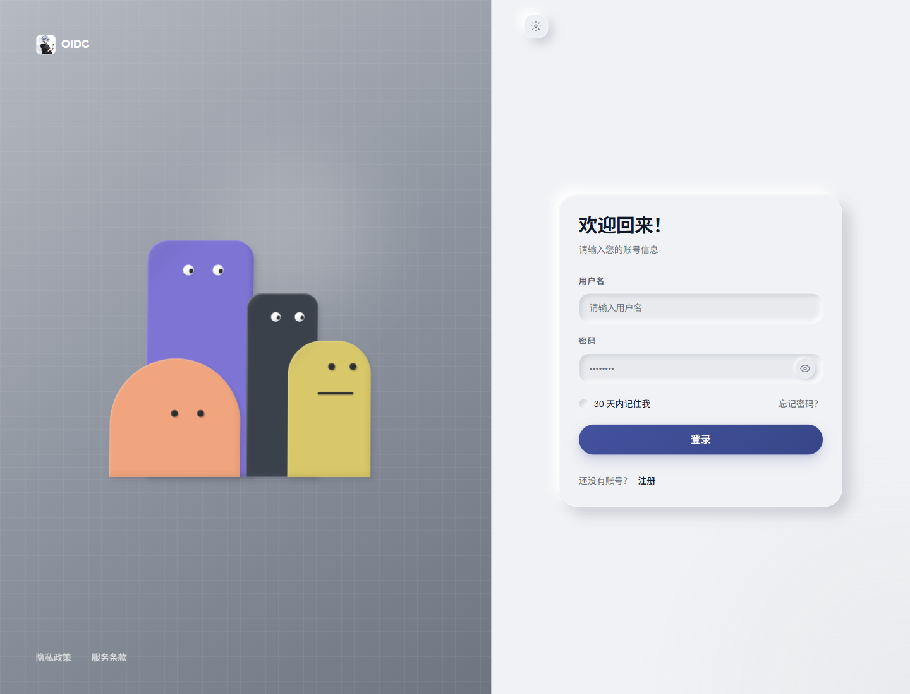
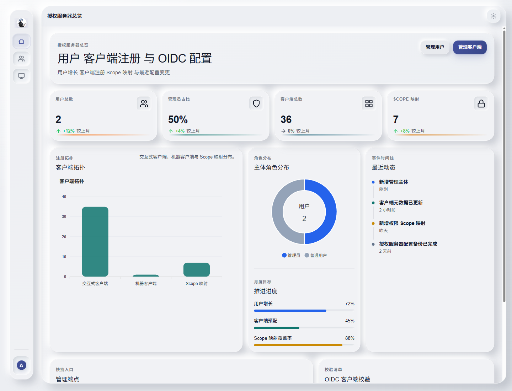
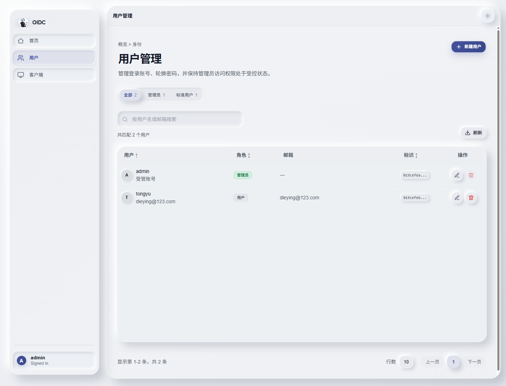
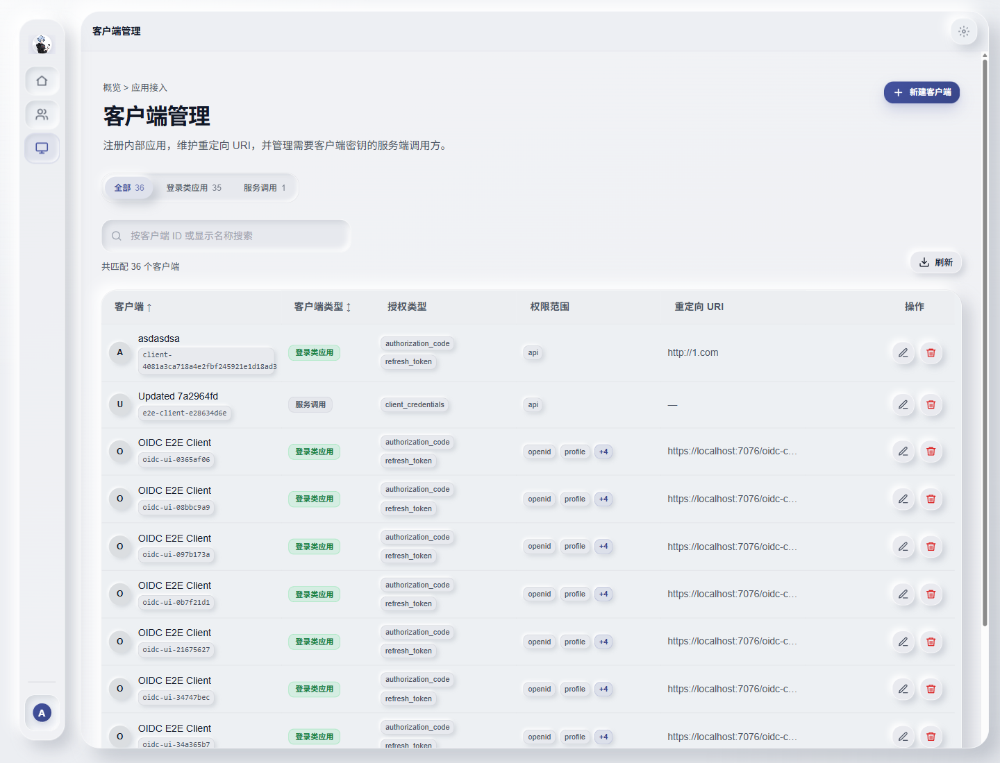
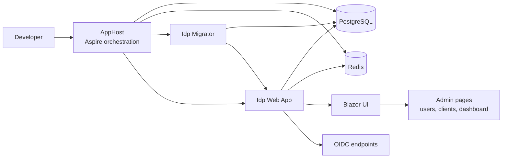

# BzsOIDC

[English Guide](./docs/README.en.md) | [中文文档](./docs/README.zh-CN.md)

`BzsOIDC` 是一个基于 **.NET 10** 的身份平台仓库，核心应用是 `BzsOIDC.Idp`。
它把 **ASP.NET Core + Blazor + OpenIddict + EF Core + PostgreSQL + Redis + .NET Aspire** 组合成一套可本地编排、可测试、可容器化部署的 OIDC / 身份系统。

## 这是一个什么项目

这个仓库当前主要提供一套完整的身份平台体验：

- 登录、注销、注册等账号入口
- OIDC 授权 / Token / UserInfo 等协议能力
- 用户管理、客户端管理、概览仪表盘等后台界面
- 权限、范围、种子账号、数据库迁移和本地分布式运行环境

如果你想快速理解这个项目，看下面几张真实页面截图就够了。

## 页面预览

### 登录页



### 首页 / 概览页



### 用户管理页



### 客户端管理页



## 本地运行时长什么样

本仓库的本地开发不是单独跑一个 Web 项目，而是通过 Aspire 把整套依赖一起拉起来：



简单理解：

- `src/BzsOIDC.AppHost` 负责本地编排
- `src/BzsOIDC.Idp` 是主 Web 应用
- `src/BzsOIDC.Idp.Migrator` 负责迁移和种子数据
- PostgreSQL / Redis 作为依赖资源由 Aspire 一起管理

## 快速开始

### 环境要求

- .NET SDK 10
- Node.js / npm
- Aspire CLI
- Docker Desktop（或其他 Aspire 可用容器运行时）

### 安装与构建

```bash
dotnet restore BzsOIDC.sln
dotnet build BzsOIDC.sln
```

### 启动整套本地环境

```bash
aspire run
```

本地默认管理员账号（开发环境）：

- 用户名：`admin`
- 密码：`Passw0rd!`

启动后可以直接访问：

- 登录页：`/login`
- 首页：`/`
- 用户管理：`/admin/users`
- 客户端管理：`/admin/clients`

## 这个仓库里有什么

```text
BzsOIDC/
├── src/
│   ├── BzsOIDC.AppHost/                 # Aspire 编排入口
│   ├── BzsOIDC.AppHost.ServiceDefaults/ # 服务默认配置
│   ├── BzsOIDC.Idp/                     # 身份平台主站
│   ├── BzsOIDC.Idp.Client/              # 共享客户端/UI 组件
│   ├── BzsOIDC.Idp.Migrator/            # 数据库迁移与种子
│   └── Shared/
│       └── BzsOIDC.Shared.Infrastructure/
├── tests/
│   ├── BzsOIDC.Idp.UnitTests/
│   ├── BzsOIDC.Idp.IntegrationTests/
│   └── BzsOIDC.Idp.E2ETests/
├── deploy/
├── docs/
└── .github/workflows/
```

## 测试与验证

仓库目前有三层测试：

- Unit：xUnit + NSubstitute + bUnit
- Integration：ASP.NET Core TestHost + SQLite
- E2E：Playwright + Aspire

常用命令：

```bash
dotnet test BzsOIDC.sln
```

如果只想跑某一层：

```bash
dotnet test tests/BzsOIDC.Idp.UnitTests/BzsOIDC.Idp.UnitTests.csproj
dotnet test tests/BzsOIDC.Idp.IntegrationTests/BzsOIDC.Idp.IntegrationTests.csproj
dotnet test tests/BzsOIDC.Idp.E2ETests/BzsOIDC.Idp.E2ETests.csproj
```

## 生产部署相关

仓库里已经提供容器化与部署样例：

- `deploy/docker-compose.yml`
- `deploy/docker-compose.with-infra.yml`
- `deploy/.env.example`
- `deploy/deploy.sh`

如果你需要更详细的部署与文档说明，可以继续看：

- [docs/README.zh-CN.md](./docs/README.zh-CN.md)
- [docs/README.en.md](./docs/README.en.md)
- [docs/github-cicd-ubuntu-docker-plan.md](./docs/github-cicd-ubuntu-docker-plan.md)
- [AGENTS.md](./AGENTS.md)

## 一句话总结

`BzsOIDC` 现在是一套偏完整的 **身份平台 / OIDC 管理后台** 仓库：

- 本地用 Aspire 一键拉起
- 页面已经覆盖登录、概览、用户和客户端管理
- 测试链路完整
- 可以继续往生产部署、接入业务应用和扩展身份能力方向演进
