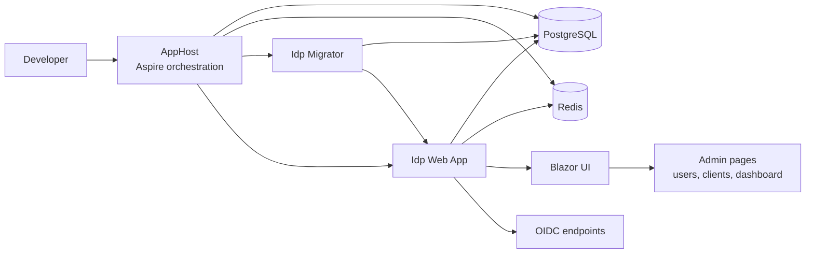

# BzsCenter

[Detailed English Guide](./docs/README.en.md) | [详细中文文档](./docs/README.zh-CN.md)

`BzsCenter` is a `.NET 10` identity platform centered on `BzsCenter.Idp`.
It combines ASP.NET Core, Blazor, OpenIddict, EF Core, PostgreSQL, Redis, and .NET Aspire into a repository that supports local orchestration, automated testing, container publishing, and Docker-based deployment.

## At a Glance

- Local development runs as a small distributed stack with Aspire.
- The main product surface is an IDP web app with authentication, localization, and admin tooling.
- Database migration and seed data are handled by a dedicated migrator project.
- The repo includes unit, integration, and end-to-end test layers.
- CI builds and validates the solution; `main` publishes container images.

## What This Repository Contains

`BzsCenter` is organized around one production application and a few supporting projects:

| Project | Purpose |
| --- | --- |
| `src/BzsCenter.Idp` | Main ASP.NET Core + Blazor identity application |
| `src/BzsCenter.Idp.Client` | Shared client-side UI/services used by the Blazor front end |
| `src/BzsCenter.Idp.Migrator` | Database migration and seed executable |
| `src/BzsCenter.AppHost` | Aspire entrypoint for local orchestration |
| `src/BzsCenter.AppHost.ServiceDefaults` | Shared service defaults, telemetry, and health wiring |
| `src/Shared/BzsCenter.Shared.Infrastructure` | Shared infrastructure helpers |
| `tests/BzsCenter.Idp.UnitTests` | Unit tests with xUnit, NSubstitute, and bUnit |
| `tests/BzsCenter.Idp.IntegrationTests` | Integration tests with TestHost + SQLite |
| `tests/BzsCenter.Idp.E2ETests` | End-to-end tests with Playwright + Aspire |

## Product Surface

Grounded in the current codebase, the IDP includes:

- Account flows such as login, logout, and register
- OIDC endpoints for authorize, token, and userinfo flows
- Admin UI for user management, client management, and dashboard summaries
- Permission and scope management APIs
- Localization support for English and Simplified Chinese
- Theme and UI preference handling on the authentication surface

Relevant entry points include:

- `src/BzsCenter.Idp/Program.cs`
- `src/BzsCenter.Idp/Controllers/ConnectController.cs`
- `src/BzsCenter.Idp/Controllers/AccountController.cs`
- `src/BzsCenter.Idp/Controllers/AdminDashboardController.cs`
- `src/BzsCenter.Idp/Controllers/OidcClientsController.cs`
- `src/BzsCenter.Idp/Controllers/PermissionScopesController.cs`

## Architecture



For local development, `src/BzsCenter.AppHost/AppHost.cs` orchestrates PostgreSQL, Redis, the web app, and the migrator. The migrator runs before the IDP is considered ready.

For production, the repository is set up around deploying `BzsCenter.Idp` and `BzsCenter.Idp.Migrator` as separate containers rather than moving the Aspire AppHost directly into production.

## Quick Start

### Prerequisites

- .NET SDK 10
- Node.js and npm
- Aspire CLI on `PATH`
- Docker or another Aspire-compatible container runtime

### Restore and build

```bash
dotnet restore BzsCenter.sln
dotnet build BzsCenter.sln
```

### Run the full local stack

```bash
aspire run
```

Development defaults from `src/BzsCenter.AppHost/AppHost.cs`:

- Username: `admin`
- Password: `Passw0rd!`

### Run only the web app

```bash
dotnet run --project src/BzsCenter.Idp/BzsCenter.Idp.csproj
```

## Frontend Asset Pipeline

`src/BzsCenter.Idp` includes a frontend asset pipeline based on Tailwind CSS and GSAP.

Run these from `src/BzsCenter.Idp/` when needed:

```bash
npm install
npm run css:build
npm run css:watch
npm run gsap:copy
```

`src/BzsCenter.Idp/BzsCenter.Idp.csproj` already runs `css:build` and `gsap:copy` before `Build` and `Publish`, but `npm install` is still your responsibility on a fresh machine or after dependency changes.

## Database and Seed Data

`src/BzsCenter.Idp.Migrator/Program.cs` is responsible for applying migrations and running `IdentitySeeder`.

Typical EF Core commands from `src/BzsCenter.Idp/`:

```bash
dotnet ef migrations add <MigrationName> --context IdpDbContext
dotnet ef database update --context IdpDbContext
```

## Test Matrix

Run all tests:

```bash
dotnet test BzsCenter.sln
```

Run by layer:

```bash
dotnet test tests/BzsCenter.Idp.UnitTests/BzsCenter.Idp.UnitTests.csproj
dotnet test tests/BzsCenter.Idp.IntegrationTests/BzsCenter.Idp.IntegrationTests.csproj
dotnet test tests/BzsCenter.Idp.E2ETests/BzsCenter.Idp.E2ETests.csproj
```

Current test setup:

| Layer | Stack | Purpose |
| --- | --- | --- |
| Unit | xUnit + NSubstitute + bUnit | Controllers, services, and component behavior |
| Integration | ASP.NET Core TestHost + SQLite | HTTP/controller flows and server behavior |
| E2E | Playwright + Aspire | Browser-level auth, admin, and OIDC flows |

Example filtered runs:

```bash
dotnet test tests/BzsCenter.Idp.UnitTests/BzsCenter.Idp.UnitTests.csproj --filter "FullyQualifiedName=BzsCenter.Idp.UnitTests.Controllers.PermissionScopesControllerTests.GetByPermission_WhenPermissionEmpty_ReturnsValidationProblem"
dotnet test tests/BzsCenter.Idp.E2ETests/BzsCenter.Idp.E2ETests.csproj --filter "FullyQualifiedName=BzsCenter.Idp.E2ETests.AuthExperienceE2ETests.LoginPage_AllowsThemeAndLanguageSwitching"
```

## CI/CD and Deployment

The checked-in automation is now image-publish focused:

- `/.github/workflows/ci.yml`
  - validates pull requests targeting `main`
  - validates pushes to `main`
  - builds, formats, tests, runs E2E, and builds container images
  - publishes GHCR images only from `main` pushes

The `deploy/` directory contains production-oriented example assets for manual or external-platform deployment rather than a checked-in auto-deploy workflow:

Container and deployment assets live in:

- `src/BzsCenter.Idp/Dockerfile`
- `src/BzsCenter.Idp.Migrator/Dockerfile`
- `deploy/docker-compose.yml`
- `deploy/docker-compose.with-infra.yml`
- `deploy/deploy.sh`
- `deploy/.env.example`

Current image names follow the repository owner prefix configured in CI and the example env file:

- `${GHCR_IMAGE_PREFIX}/bzscenter-idp`
- `${GHCR_IMAGE_PREFIX}/bzscenter-idp-migrator`

## Production Notes

The checked-in production example expects:

- either external PostgreSQL/Redis services or the optional bundled infra overlay
- OIDC signing and encryption certificates
- Data Protection key persistence
- Reverse-proxy-aware forwarded headers
- Explicit admin seed credentials

Recommended usage patterns:

- External infra already exists: use `deploy/docker-compose.yml`
- Need a self-contained example stack: use `deploy/docker-compose.yml` together with `deploy/docker-compose.with-infra.yml`

The example Docker setup is now Compose-driven: `idp-migrator` is a one-shot service and `idp` waits for it with `service_completed_successfully` before starting.

## Repository Map

```text
BzsCenter/
├── src/
│   ├── BzsCenter.AppHost/
│   ├── BzsCenter.AppHost.ServiceDefaults/
│   ├── BzsCenter.Idp/
│   ├── BzsCenter.Idp.Client/
│   ├── BzsCenter.Idp.Migrator/
│   └── Shared/
│       └── BzsCenter.Shared.Infrastructure/
├── tests/
│   ├── BzsCenter.Idp.UnitTests/
│   ├── BzsCenter.Idp.IntegrationTests/
│   └── BzsCenter.Idp.E2ETests/
├── deploy/
├── docs/
└── .github/workflows/
```

## Documentation

Use the root README as the landing page, then jump deeper as needed:

- Chinese guide: `docs/README.zh-CN.md`
- English guide: `docs/README.en.md`
- CI/CD and Ubuntu Docker plan: `docs/github-cicd-ubuntu-docker-plan.md`
- Repo-specific engineering guidance: `AGENTS.md`

## English Summary

If you only need the short version: BzsCenter is a `.NET 10` identity platform repository built around an ASP.NET Core + Blazor IDP, local Aspire orchestration, layered automated testing, container publishing, and manual production deployment examples. For full English setup and operational details, start with `docs/README.en.md`.
